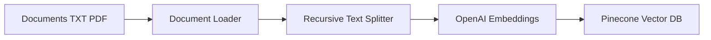
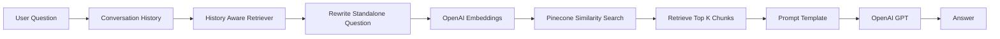
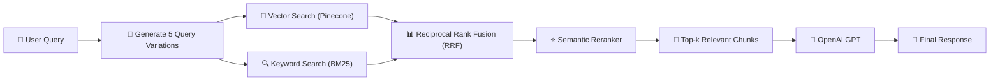

<!-- ============================= -->
<!-- Header -->
<!-- ============================= -->

<h1 align="center">🧠 Toronto Travel Assistant - RAG Chatbot</h1>

<p align="center">
  <b>Retrieval-Augmented Generation (RAG) Chatbot built with LangChain, OpenAI, Pinecone and Streamlit</b>
</p>

<p align="center">


</p>

---

# 📌 Overview

The goal of this project is to develop a domain-specific AI chatbot that combines the reasoning capability of an OpenAI Large Language Model with the efficiency of Pinecone Vector Database using Retrieval-Augmented Generation (RAG).

Instead of relying entirely on the LLM's internal knowledge, the chatbot first retrieves relevant information from custom documents and then generates an accurate, context-aware response.

The chatbot also supports multi-turn conversations using LangChain's conversation memory, enabling users to ask follow-up questions naturally.

---

# ✨ Features

- ✅ Retrieval-Augmented Generation (RAG)
- ✅ OpenAI GPT-4.1 Mini
- ✅ OpenAI Embeddings (text-embedding-3-small)
- ✅ Pinecone Vector Database
- ✅ LangChain
- ✅ Streamlit Chat Interface
- ✅ Conversation Memory
- ✅ Follow-up Question Support
- ✅ Semantic Search
- ✅ Production Style Ingestion Pipeline

---

# 🏗 Overall Architecture


---

# 📥 Ingestion Pipeline



---

# 📤 Retrieval Pipeline



---


---

# ⚙️ Technology Stack

| Component | Technology |
|------------|------------|
| Frontend | Streamlit |
| Backend | LangChain |
| LLM | OpenAI GPT-4.1 Mini |
| Embeddings | OpenAI text-embedding-3-small |
| Vector Database | Pinecone |
| Programming Language | Python |
| Environment Variables | python-dotenv |

---

# 🚀 Installation

Clone repository

```bash
git clone https://github.com/yourusername/Toronto-RAG-Chatbot.git
```

Go inside project

```bash
cd Toronto-RAG-Chatbot
```

Install dependencies

```bash
pip install -r requirements.txt
```

---

# 🔑 Create .env

```env
OPENAI_API_KEY=your_openai_api_key

PINECONE_API_KEY=your_pinecone_api_key
```

---

# ▶️ Run Ingestion Pipeline

```bash
python ingestion.py
```

This script

- Loads documents
- Splits them into chunks
- Generates OpenAI embeddings
- Stores vectors in Pinecone

---

# ▶️ Run Chatbot

```bash
streamlit run streamlitMain.py
```

Open

```
http://localhost:8501
```

---

# 📚 Key Concepts

- Retrieval-Augmented Generation (RAG)
- LangChain
- OpenAI GPT
- Prompt Engineering
- Semantic Search
- Vector Embeddings
- Pinecone
- Conversation Memory
- History Aware Retrieval
- Streamlit

---

---

# 🚀 Future Improvements

To further improve retrieval accuracy and make the chatbot production-ready, the following enhancements can be implemented:

### 🔹 Multi-Query RAG
Generate multiple semantic variations (e.g., 5) of the user's query using an LLM instead of relying on a single query. This improves the chances of retrieving all relevant documents.

### 🔹 Hybrid Search
Combine **Vector Search (Pinecone)** with **Keyword Search (BM25 / Full-Text Search)**. This allows the system to retrieve both semantically similar documents and those containing exact keywords such as product names, IDs, or technical terms.

### 🔹 Reciprocal Rank Fusion (RRF)
Merge results from multiple retrieval strategies (Multi-Query + Hybrid Search) using **Reciprocal Rank Fusion (RRF)** to produce a more robust ranked list of documents.

### 🔹 Semantic Reranking
Use a reranking model (e.g., **Cohere Rerank**, **BGE Reranker**, or **CrossEncoder**) to reorder retrieved documents before passing them to the LLM, ensuring only the most relevant context is used.

---

## 🏗 Proposed Production RAG Pipeline



**Benefits**
- ✅ Higher retrieval accuracy
- ✅ Better document recall
- ✅ Improved handling of exact keywords and IDs
- ✅ Reduced hallucinations
- ✅ Better responses for complex and ambiguous queries
- ----

# 🎯 Learning Outcomes

Through this project I learned

- Building production-ready RAG applications
- Working with OpenAI APIs
- Creating semantic search pipelines
- Using Pinecone Vector Database
- Prompt Engineering
- LangChain Retrieval Chains
- Multi-turn Conversation Memory
- Deploying AI applications using Streamlit


<p align="center">

⭐ If you found this repository useful, don't forget to star it!

</p>
